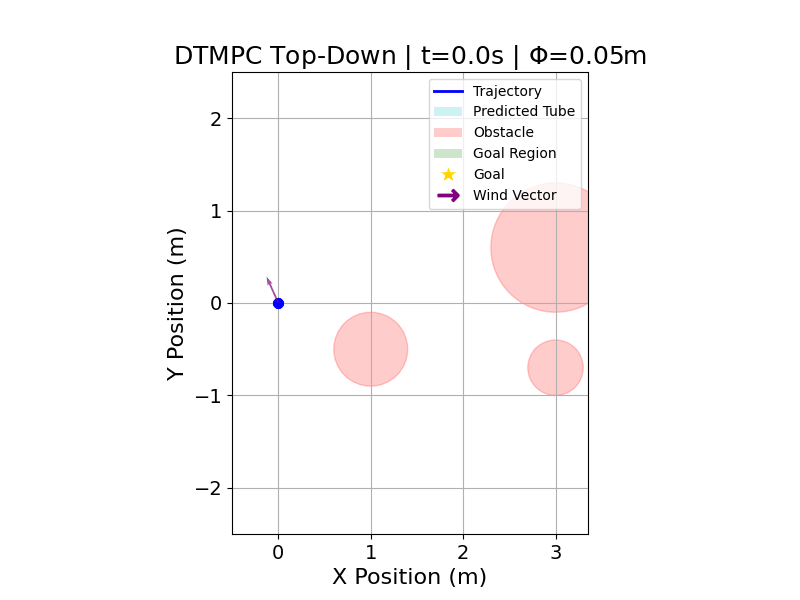
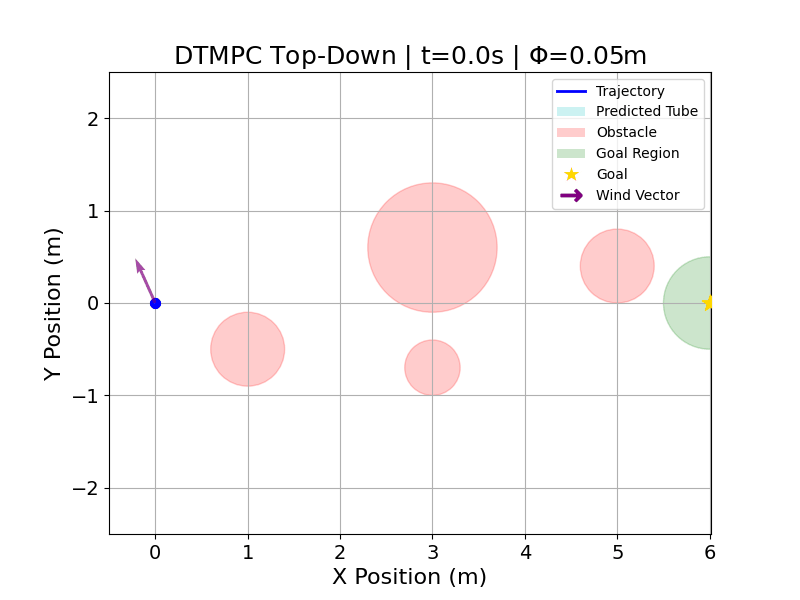

# staggered-integral-ocp

This repository accompanies the paper "Staggered Integral Online Conformal Prediction for Safe Dynamics Adaptation with Multi-Step Coverage Guarantees." The paper introduces Staggered Integral Online Conformal Prediction (SI-OCP), an algorithm utilizing an a new conformal prediction score function 
to quantify the lumped effect of disturbance and learning
error. This approach provides long-run coverage guarantees of the lumped disturbance,
resulting in long-run safety when synthesized with safety-
critical controllers, including robust tube model predictive
control. This repo provides the code for a numerical simulation of an all-layer deep neural network (DNN) adaptive quadcopter using robust tube model predictive
control (MPC), highlighting the applicability of our method
to complex learning parameterizations and control strategies.

## Requirements

- Python 3.11+
- Git
- [uv](https://docs.astral.sh/uv/)

## Install

```bash
git clone https://github.com/dcherenson/staggered-integral-ocp.git
cd staggered-integral-ocp
uv sync
```

## Run Scenarios

Run from the repository root.

### 1) Adaptation OFF

```bash
uv run python main.py --scenario adaptation_off
```

### 2) Adaptation ON

```bash
uv run python main.py --scenario adaptation_on
```

## Scenario Notes

- `adaptation_off`: uses a frozen pre-trained SSML model (`gamma_lr = 0.0`).
- `adaptation_on`: enables online SSML weight adaptation (`gamma_lr > 0`).

## Outputs

Each run writes figures/animations into `output/`:

- `output/top_down_animation.gif`
- `output/top_down_tube.png`
- `output/si-ocp_vs_true.png`
- `output/nn_params_vs_time.png`

If you want to compare both scenarios side by side, save each run's outputs before running the next scenario.

### Adaptation OFF



### Adaptation ON



## Citation

If you use this repository, please consider citing the paper:

```bibtex
@inproceedings{cherenson2026staggered,
  title={Staggered Integral Online Conformal Prediction for Safe Dynamics Adaptation with Multi-Step Coverage Guarantees},
  author={Cherenson, Daniel M and Panagou, Dimitra},
  booktitle={},
  year={2026}
}
```